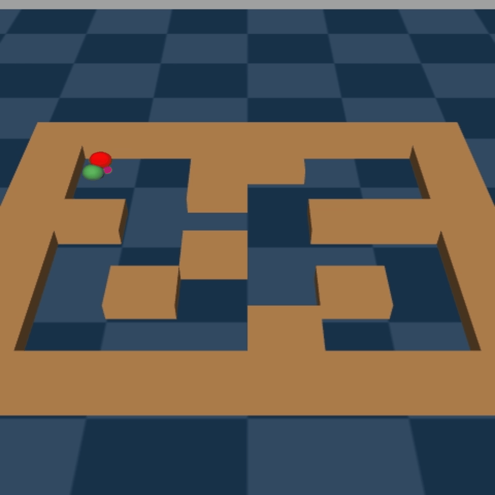

# Decoupling Planning from Control: Stable Hierarchical RL with a Learned Metric Space


This repository provides the official implementation for the paper "Decoupling Planning from Control: Stable Hierarchical RL with a Learned Metric Space".
<div align="center">
  
</div>

## Overview

This work introduces a Hierarchical Reinforcement Learning (HRL) framework that resolves the fundamental **non-stationarity problem**. We achieve this by **decoupling high-level planning from low-level control**. Instead of learning from an unstable, concurrently training worker policy, our high-level planner learns to navigate a stable "map" of the environment. This map is represented by a critic network trained as a metric space, where distances reflect optimal travel costs. This approach enables stable  learning, especially for resource-constrained agents.


## Reproducing Experiments

The main experiments from the paper can be reproduced by running the provided shell scripts. Logs will be saved to the `trainlogs/`  directory.

### Experiment 1: Performance with a Resource-Constrained Low-level Policy (Fig. 3)


```bash
bash Run_1constrained.sh
```

### Experiment 2: Performance with a Capable Low-level Policy (Fig. 4)


```bash
bash Run_2capable.sh
```


### Experiment 3: Performance with Multiple Specialized Low-level Controllers (Fig. 5)


```bash
bash Run_3multi.sh
```

### Experiment 4: Analysis of N-hop Refinement (Fig. 8, Appendix)

```bash
bash Run_4appx_nhop.sh
```

## Code Structure

  * `main.py`: Main script to run all experiments.
  * `run.sh`, `run_constrained.sh`: Helper scripts called by the `Run_*.sh` scripts to launch individual training jobs.
  * `src/agent/`:
      * `Hierarchical.py`: Core implementation of our proposed hierarchical agent.
      * `her_triangle.py`: Implementation of the baseline agent used for comparison.
      * `base.py`, `ddpg.py`, `her.py`: Base classes for the agents.
  * `src/model.py`: Defines the neural network architectures.
      * `CriticHierarchical`: The critic that learns the metric space, i.e., MRN critic.
      * `HighLevelActor`, `PrimitiveActor`: The high-level planner and low-level worker policies.
  * `src/args.py`: Defines hyperparameters.
  * `src/utils.py`, `src/sampler.py`, `src/replay_buffer.py`: Helper functions


